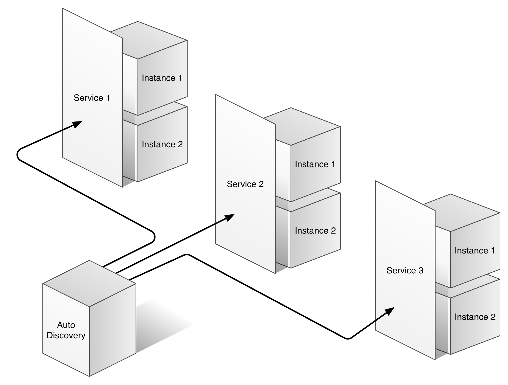

# NIXus

**NIXus** a docker powerered next generation *application server* kind.

Application servers are typically coupled to ecosystems like .NET platform or JavaEE.
They are able to run just some kind of applications. In JavaEE, a server will run just JVM aplications deployed as WAR or EAR files.

*Docker* is a relatively new technology. It's an *application container*.
It allows to run any contenerized application without having to install all the required runtime in the host machine.

**NIXus** is basically a group of microservices containers that run in choreography.

> Basically it can run anything.

# Usage

Install [Docker Toolbox](https://www.docker.com/products/docker-toolbox) and configure docker.

Run the following command:
```
curl -L https://raw.githubusercontent.com/aitoroses/NIXus/master/install.sh
```

Get **NIXus** running:

```
$ nixus start
```

Run a hello world container two times, and specify a NIXUS_{PORT}:
```
$ docker run -it -p :8000 -e NIXUS_8000=whoami-app jwilder/whoami
$ docker run -it -p :8000 -e NIXUS_8000=whoami-app jwilder/whoami

```

Try to do a CURL:
```
$ curl -L http://dev.docker/whoami-app
$ curl -L http://dev.docker:8000
```

Will return the container ID of the one that responds.
```
I'm c1b218dd8881
```

If you setup your DNS to resolve `whoami.dev.docker` you can also do
```
curl -L http://whoami-app.dev.docker
```

Thats all, your hello-world container is running with service discovery and clusterized.


# How does it work?



NIXus registers when a new container has started/stoped 
and then it creates the correspoinding configuration files and stores the required container information.

# Service Autodiscovery

The **autodiscovery** container magically is able to map a route to a container automatically.

For example, just by doing `docker run -it -p :8000 -e NIXUS_8000=hello-app hello` the hello image will run as a container and it's context will be `hello-app`.

The port `tcp/8000` will be mapped to an arbitrary port in the host `tcp/8000 -> tcp/31892`.

NIXus will recognize that information and make the container discoverable through:

* `http://domain.com:8000`
* `http://domain.com/hello-app`
* `http://hello-app.domain.com`


---

# Clusterization

Other interesting property is that the proxy can replicate and load balance those containers across different hosts, 
so that each container is clusterizable on itself.

Like in the example above, we can just do:

* `docker run -it -p :8000 NIXUS_8000=hello-app hello`
* `docker run -it -p :8000 NIXUS_8000=hello-app hello`
* `docker run -it -p :8000 NIXUS_8000=hello-app hello`

The same container will be spawned 3 times and NIXus will handle load balancing by default.

# License

Licensed under the MIT license. 2016 aitor.oses@gmail.com